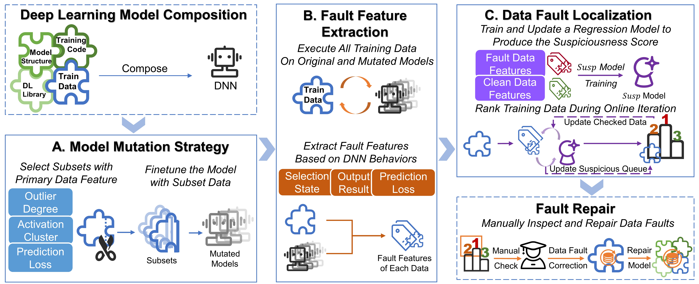

# DFauLo 

## Description
This repository is the official implementation of the tool **DfauLo**.

**DfauLo** is a dynamic data fault localization tool for deep neural networks (DNNs), which can locate mislabeled and noisy data in the deep learning datasets. Inspired by conventional mutation-based code fault localization, **DfauLo** generates multiple DNN model mutants of the original trained DNN model and maps the extracted features into a suspiciousness score indicating the probability of the given data being a data fault. **DfauLo** is the first dynamic data fault localization technique, prioritizing the suspected data based on user feedback and providing the generalizability to unseen data faults during training.

The tool works by taking *a trained model and its optimizer and lr_scheduler (if available)*, and *a (classification) dataset* for data fault localization in the required format. It then generates multiple DNN model mutants, extracts features from these mutants, and maps the extracted features into a suspiciousness score indicating the probability of the given data being a data fault. The user can then prioritize the suspected data for manual checking and correction to improve the data quality with minimal effort. The tool can effectively locate different types of data faults and improve the model performance by correcting the located faults.

The implementation of **DfauLo** as a tool allows for the automatic location of data faults hidden in deep learning datasets. It is applicable for various types of deep learning datasets and can be used to validate the data quality for DNNs. The source code for the tool is available for use and can be customized according to specific requirements.


 

[comment]: <> (## Sequence of code execution in the repository)

[comment]: <> (```mermaid)

[comment]: <> (graph LR)

[comment]: <> (cifar10_gendata --> cifar10_train;)

[comment]: <> (cifar10_train --> cifar10_Outlier;)

[comment]: <> (cifar10_train --> cifar10_Activation;)

[comment]: <> (cifar10_train --> cifar10_PreLoss;)

[comment]: <> (cifar10_Outlier --> cifar10_mutation;)

[comment]: <> (cifar10_Activation --> cifar10_mutation;)

[comment]: <> (cifar10_PreLoss --> cifar10_mutation;)

[comment]: <> (cifar10_mutation --> cifar10_DFauLo;)

[comment]: <> (```)
## Installation
`pip install -r requirements.txt`

## Usage
You should first prepare your classification dataset for data fault localization according to the following format (The root directory is the name of the dataset, the subordinate directory represents it as the training set, then each set directory is named by the class name of the dataset, and the images of the corresponding class are stored):
```python
MNIST # dataset name
|-- train # trainset
    |-- 0 # class name
        |-- XX.png # corrensponding images
        |-- XX.png
        |-- ...
    |-- 1
        |-- XX.png
        |-- XX.png
        |-- ...
    |-- ...
```
Next you need to prepare a model trained on the above dataset (note that you need to provide the entire model and not just the parameters of the model) and the model's 
optimizer and lr_scheduler (if available), we recommend that you save your model in the following form:
```python
torch.save({
            "epoch": epoch, #optional
            "model": model,
            "optimizer": optimizer,
            "lr_scheduler": lr_scheduler, #optional
            "acc": 100 * correct / total #optional
        }, './models/model.pth')
```
Finally you can run our **DfauLo** tool by:
+ `python DfauLo.py --dataset /yourdatasetpath --model /yourmodelpath --img_size '(28,28,3)'--retrain_epoch 10`

Parameter explanation:

`--dataset /yourdatasetpath` : Datasets requiring data fault localization

`--model /yourmodelpath` : Corresponding trained model

`--img_size '(28,28,3)'` : Model input image size in (w,h,d) format

`--retrain_epoch 10` : Epoch for model fine-tuning with DfauLo tool


Some `DfauLo.py` results on MNIST are shown below :
<div><table frame=void>	<!--用了<div>进行封装-->
	<tr>
        <td><div><center>	<!--每个格子内是图片加标题-->
        		<!--高度设置-->
        	<br>	<!--换行-->
        	label: 4	<!--标题1-->
        </center></div></td>    
     	<td><div><center>	<!--第二张图片-->
    			
    		<br>
    		label: 7
        </center></div></td>
        <td><div><center>	<!--每个格子内是图片加标题-->
        		<!--高度设置-->
        	<br>	<!--换行-->
        	label: 6	<!--标题1-->
        </center></div></td> 
        <td><div><center>	<!--每个格子内是图片加标题-->
        		<!--高度设置-->
        	<br>	<!--换行-->
        	label: 7	<!--标题1-->
        </center></div></td> 
        <td><div><center>	<!--每个格子内是图片加标题-->
        		<!--高度设置-->
        	<br>	<!--换行-->
        	label: 1	<!--标题1-->
        </center></div></td> 
	</tr>
</table></div>


